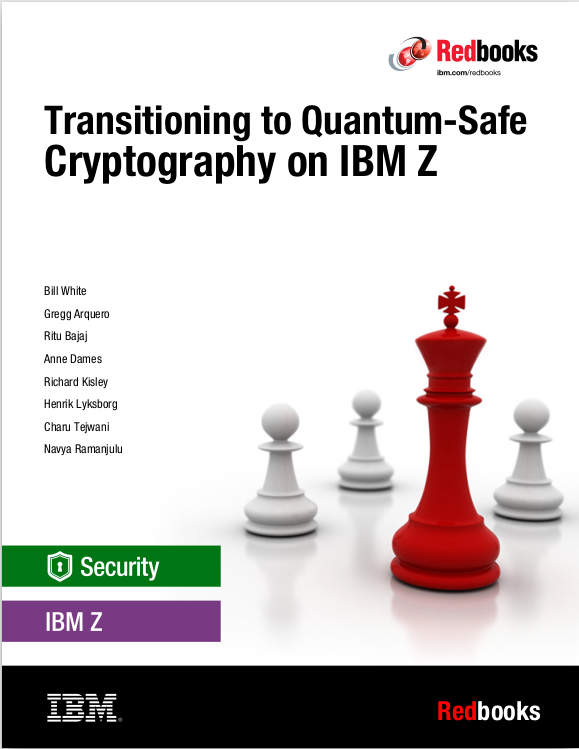

# qsafe-redbook
Jupyter Notebook Sample material to support the SG248525 - Transitioning to Quantum-Safe Cryptography on IBM Z

In this section there are 3 files
- An executable jupyter notebook to download and work with against an IBM CAT database if such a database exists within the enterprise.
- A Markdown version of the jupyter notebook executed against an IBM CAT sample database
- A zip file with an HTML version of the executed jupyter notebook to download for potential presentaion in the enterprise.
