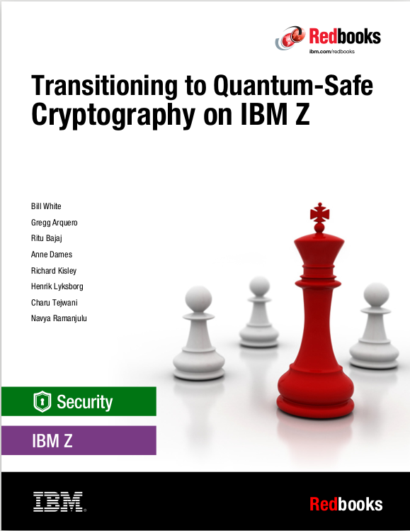
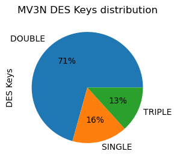
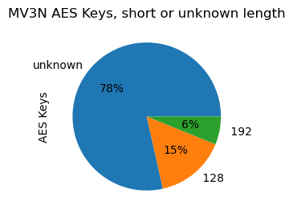

Sample Jupyter Notebook to cover 

### Identify Cryptographic Algorithms across systems and jobs

from the chapter 5.6 of the



In order to execute the Jupyter Notebook against Your own IBM CAT database there are a series of steps to perform before the Jupyter Notebook and the IBM DB2 connection will work.
***

These steps are very well described in the public IBM db2-jupyter github section.
https://github.com/IBM/db2-jupyter/tree/master

If however You just want to study the output of the sample execution then please proceed to [Query the Distribution of Keys in the Sysplex](#SampleStart)


```python
#First install the DB2 support
!/home/lyksborg/anaconda3/bin/pip install ipython-sql
!/home/lyksborg/anaconda3/bin/pip install ibm_db
!/home/lyksborg/anaconda3/bin/pip install ibm_db_sa
!/home/lyksborg/anaconda3/bin/pip install qgrid
!/home/lyksborg/anaconda3/bin/pip install itables
```

### You need a Db2 connect license file to connect to a z/OS database.

### Load the DB2 Extensions


```python
import ibm_db
import pandas as pd
import numpy as np
import seaborn as sns
import matplotlib.pyplot as plt
from datetime import timedelta 
%run db2.ipynb
```

    Db2 Extensions Loaded. Version: 2024-09-16


### Connect to the IBM CAT Database and set the SQLID


```python
#A userID with access to the IBM CAT Database
print("Database Name: ")
dbname=input()
print("Host: ")
dbhost=input()
print("Port Number: ")
dbport=input()
print("Username: ")
dbuser=input()
#The below connect statement connects to one of our internal IBM CAT Databases
#%sql CONNECT TO DSNV133N USER $dbuser USING ? HOST winmvs3n.hursley.ibm.com PORT 43100
%sql CONNECT TO $dbname USER $dbuser USING ? HOST $dbhost PORT $dbport
print("SQL id: ")
sqlid=input()
schema = "'" + sqlid + "'"
#Schema name....
%sql SET CURRENT SQLID = $schema
```

    Database Name: 
    DSNV133N
    Host: 
    winmvs3n.hursley.ibm.com
    Port Number: 
    43100
    Username: 
    dphly
    Password [password]: ········


    Connection successful. DSNV133N @ winmvs3n.hursley.ibm.com 
    SQL id: 
    KRYPROD
    Command completed.


### Select the sysplex to work with and the snapshot date.


```python
#Select the sysplex - systems represented in the IBM CAT Database
sysPlexSelect = "SELECT DISTINCT CAT_ENV_SYSPLEX AS SYSPLEX, CAT_ENV_SYSNAME AS SYSTEM," \
" DATE(CAT_ENV_SAMPLE_DATE) AS SNAPDATES FROM CAT_ENV"
sysPlexSystems = %sql $sysPlexSelect
print("Available Sysplexes and Systems:" )
print(sysPlexSystems.drop_duplicates())
print("Enter Sysplex ID:")
sysplex=input()
print("Enter snapshot date")
snapDate=input()
#Construct the UUID - Systemname join sub-select
SysSubSelect = "select distinct cat_env_uuid, cat_env_sysname from cat_env where cat_env_sysplex = '"\
+ sysplex + "' and date(cat_env_sample_date) = '" + snapDate + "'"
```

    Available Sysplexes and Systems:
         SYSPLEX    SYSTEM   SNAPDATES
    0   MV3N      MV3N      2024-12-01
    1   MV3N      MV3N      2024-12-02
    2   MV3N      MV3N      2024-12-03
    3   MV3N      MV3N      2024-12-04
    4   MV3N      MV3N      2024-12-05
    ..       ...       ...         ...
    11  MV3N      MV3N      2024-12-12
    12  MV3N      MV3N      2024-12-13
    13  MV3N      MV3N      2024-12-14
    14  MV3N      MV3N      2024-12-15
    15  MV3N      MV3N      2024-12-16
    
    [16 rows x 3 columns]
    Enter Sysplex ID:
    MV3N
    Enter snapshot date
    2024-12-12


### Test the subselect..... and verify that the number uuids are as expected, eg. one per system.


```python
#Test the UUID where clause..... and verify that the number uuids are as expected, eg. one per system. 
uuidCheck = %sql select cat_env_sysname, cat_cda_uuid from cat_cda, ($SysSubSelect) where cat_cda_uuid = cat_env_uuid
print(uuidCheck.drop_duplicates())
```

      CAT_ENV_SYSNAME                          CAT_CDA_UUID
    0        MV3N      202412120500298599781C32F2DBCFA15C0C


<a id="SampleStart"></a>
# Query the distribution of keys in the sysplex

#### DES Keys


```python
#Use DB2 queries to create the data frames needed.
desKeys = %sql select cat_env_sysname, cat_des_label, cat_des_size, cat_des_kcv from cat_des, ($SysSubSelect) where cat_des_uuid = cat_env_uuid and cat_des_size <> ' '
desSize = %sql select cat_env_sysname, cat_des_size, count(cat_des_size) as sizecount from cat_des, ($SysSubSelect) where cat_des_uuid = cat_env_uuid and cat_des_size <> ' ' group by cat_env_sysname, cat_des_size
desTypeSize = %sql select cat_env_sysname, cat_des_type, cat_des_size, count(cat_des_type) as typecount from cat_des, ($SysSubSelect) where cat_des_uuid = cat_env_uuid and cat_des_size <> ' ' group by cat_env_sysname, cat_des_type, cat_des_size
```


```python
desKeys["CAT_ENV_SYSNAME"].value_counts()
```


    MV3N        8400
    Name: CAT_ENV_SYSNAME, dtype: Int64


```python
desKeysMV3A = desKeys[(desKeys['CAT_ENV_SYSNAME'].str.contains("MV3N"))]
desKeysMV3A["CAT_DES_SIZE"].value_counts().plot(kind="pie",figsize=(3,3),title="MV3N DES Keys distribution",label="DES Keys",autopct="%1.0f%%")
```


    <Axes: title={'center': 'MV3N DES Keys distribution'}, ylabel='DES Keys'>


    

    


```python
pd.set_option('display.max_rows', 15)
desSize.pivot_table(index=['CAT_ENV_SYSNAME','CAT_DES_SIZE','SIZECOUNT'])
```


<div>
<style scoped>
    .dataframe tbody tr th:only-of-type {
        vertical-align: middle;
    }

    .dataframe tbody tr th {
        vertical-align: top;
    }

    .dataframe thead th {
        text-align: right;
    }
</style>
<table border="1" class="dataframe">
  <thead>
    <tr style="text-align: right;">
      <th></th>
      <th></th>
      <th></th>
    </tr>
    <tr>
      <th>CAT_ENV_SYSNAME</th>
      <th>CAT_DES_SIZE</th>
      <th>SIZECOUNT</th>
    </tr>
  </thead>
  <tbody>
    <tr>
      <th rowspan="3" valign="top">MV3N</th>
      <th>DOUBLE</th>
      <th>5938</th>
    </tr>
    <tr>
      <th>SINGLE</th>
      <th>1347</th>
    </tr>
    <tr>
      <th>TRIPLE</th>
      <th>1115</th>
    </tr>
  </tbody>
</table>
</div>


_DES keys count by length_
***


```python
pd.set_option('display.max_rows', 150)
desTypeSingle = desTypeSize[(desTypeSize['CAT_DES_SIZE'].str.contains("SINGLE"))]
desTypeSingle.pivot_table(index=['CAT_ENV_SYSNAME','CAT_DES_SIZE', 'CAT_DES_TYPE', 'TYPECOUNT'])
```


<div>
<style scoped>
    .dataframe tbody tr th:only-of-type {
        vertical-align: middle;
    }

    .dataframe tbody tr th {
        vertical-align: top;
    }

    .dataframe thead th {
        text-align: right;
    }
</style>
<table border="1" class="dataframe">
  <thead>
    <tr style="text-align: right;">
      <th></th>
      <th></th>
      <th></th>
      <th></th>
    </tr>
    <tr>
      <th>CAT_ENV_SYSNAME</th>
      <th>CAT_DES_SIZE</th>
      <th>CAT_DES_TYPE</th>
      <th>TYPECOUNT</th>
    </tr>
  </thead>
  <tbody>
    <tr>
      <th rowspan="6" valign="top">MV3N</th>
      <th rowspan="6" valign="top">SINGLE</th>
      <th>CIPHER</th>
      <th>3</th>
    </tr>
    <tr>
      <th>CV</th>
      <th>42</th>
    </tr>
    <tr>
      <th>DATA</th>
      <th>1256</th>
    </tr>
    <tr>
      <th>DATA8</th>
      <th>1</th>
    </tr>
    <tr>
      <th>MAC</th>
      <th>34</th>
    </tr>
    <tr>
      <th>MACVER</th>
      <th>11</th>
    </tr>
  </tbody>
</table>
</div>


_Single length DES keys type distribution_
***


```python
pd.set_option('display.max_rows', 150)
desTypeSingle = desTypeSize[(desTypeSize['CAT_DES_SIZE'].str.contains("DOUBLE"))]
desTypeSingle.pivot_table(index=['CAT_ENV_SYSNAME','CAT_DES_SIZE', 'CAT_DES_TYPE', 'TYPECOUNT'])
```


<div>
<style scoped>
    .dataframe tbody tr th:only-of-type {
        vertical-align: middle;
    }

    .dataframe tbody tr th {
        vertical-align: top;
    }

    .dataframe thead th {
        text-align: right;
    }
</style>
<table border="1" class="dataframe">
  <thead>
    <tr style="text-align: right;">
      <th></th>
      <th></th>
      <th></th>
      <th></th>
    </tr>
    <tr>
      <th>CAT_ENV_SYSNAME</th>
      <th>CAT_DES_SIZE</th>
      <th>CAT_DES_TYPE</th>
      <th>TYPECOUNT</th>
    </tr>
  </thead>
  <tbody>
    <tr>
      <th rowspan="17" valign="top">MV3N</th>
      <th rowspan="17" valign="top">DOUBLE</th>
      <th>CIPHER</th>
      <th>331</th>
    </tr>
    <tr>
      <th>CV</th>
      <th>221</th>
    </tr>
    <tr>
      <th>DATA</th>
      <th>687</th>
    </tr>
    <tr>
      <th>DATA16</th>
      <th>1</th>
    </tr>
    <tr>
      <th>DATAM</th>
      <th>6</th>
    </tr>
    <tr>
      <th>DATAMV</th>
      <th>1</th>
    </tr>
    <tr>
      <th>DKYGENKY</th>
      <th>88</th>
    </tr>
    <tr>
      <th>EXPORTER</th>
      <th>841</th>
    </tr>
    <tr>
      <th>IMP-PKA</th>
      <th>230</th>
    </tr>
    <tr>
      <th>IMPORTER</th>
      <th>1607</th>
    </tr>
    <tr>
      <th>IPINENC</th>
      <th>137</th>
    </tr>
    <tr>
      <th>MAC</th>
      <th>201</th>
    </tr>
    <tr>
      <th>MACD</th>
      <th>44</th>
    </tr>
    <tr>
      <th>MACVER</th>
      <th>143</th>
    </tr>
    <tr>
      <th>OPINENC</th>
      <th>137</th>
    </tr>
    <tr>
      <th>PINGEN</th>
      <th>657</th>
    </tr>
    <tr>
      <th>PINVER</th>
      <th>606</th>
    </tr>
  </tbody>
</table>
</div>


_Double length DES keys type distribution_
***


```python
pd.set_option('display.max_rows', 150)
desTypeSingle = desTypeSize[(desTypeSize['CAT_DES_SIZE'].str.contains("TRIPLE"))]
desTypeSingle.pivot_table(index=['CAT_ENV_SYSNAME','CAT_DES_SIZE', 'CAT_DES_TYPE', 'TYPECOUNT'])
```


<div>
<style scoped>
    .dataframe tbody tr th:only-of-type {
        vertical-align: middle;
    }

    .dataframe tbody tr th {
        vertical-align: top;
    }

    .dataframe thead th {
        text-align: right;
    }
</style>
<table border="1" class="dataframe">
  <thead>
    <tr style="text-align: right;">
      <th></th>
      <th></th>
      <th></th>
      <th></th>
    </tr>
    <tr>
      <th>CAT_ENV_SYSNAME</th>
      <th>CAT_DES_SIZE</th>
      <th>CAT_DES_TYPE</th>
      <th>TYPECOUNT</th>
    </tr>
  </thead>
  <tbody>
    <tr>
      <th rowspan="11" valign="top">MV3N</th>
      <th rowspan="11" valign="top">TRIPLE</th>
      <th>CIPHER</th>
      <th>108</th>
    </tr>
    <tr>
      <th>DATA</th>
      <th>280</th>
    </tr>
    <tr>
      <th>DECIPHER</th>
      <th>6</th>
    </tr>
    <tr>
      <th>EXPORTER</th>
      <th>80</th>
    </tr>
    <tr>
      <th>IMP-PKA</th>
      <th>38</th>
    </tr>
    <tr>
      <th>IMPORTER</th>
      <th>392</th>
    </tr>
    <tr>
      <th>MAC</th>
      <th>12</th>
    </tr>
    <tr>
      <th>MACVER</th>
      <th>60</th>
    </tr>
    <tr>
      <th>OPINENC</th>
      <th>118</th>
    </tr>
    <tr>
      <th>PINGEN</th>
      <th>14</th>
    </tr>
    <tr>
      <th>PINVER</th>
      <th>7</th>
    </tr>
  </tbody>
</table>
</div>


_Triple length DES keys type distribution_
***


```python
#Use DB2 queries to create the data frames needed.
aesKeys = %sql select cat_env_sysname, cat_sym_label, case when cat_sym_t4size = ' ' then 'unknown' else cat_sym_t4size end as cat_sym_t4size, cat_sym_kcv from cat_sym, ($SysSubSelect) where cat_sym_uuid = cat_env_uuid
aesSize = %sql select cat_env_sysname, case when cat_sym_t4size = ' ' then 'unknown' else cat_sym_t4size end as cat_sym_t4size, count(cat_sym_t4size) as sizecount from cat_sym, ($SysSubSelect) where cat_sym_uuid = cat_env_uuid group by cat_env_sysname, cat_sym_t4size
aesTypeSize = %sql select cat_env_sysname, cat_sym_type, case when cat_sym_t4size = ' ' then 'unknown' else cat_sym_t4size end as cat_sym_t4size, count(cat_sym_t4size) as typecount from cat_sym, ($SysSubSelect) where cat_sym_uuid = cat_env_uuid group by cat_env_sysname, cat_sym_type, cat_sym_t4size
```


```python
aesKeys["CAT_ENV_SYSNAME"].value_counts()
```


    MV3N        21867
    Name: CAT_ENV_SYSNAME, dtype: Int64


```python
pd.set_option('display.max_rows', 20)
aesSize.pivot_table(index=['CAT_ENV_SYSNAME','CAT_SYM_T4SIZE','SIZECOUNT'])
```


<div>
<style scoped>
    .dataframe tbody tr th:only-of-type {
        vertical-align: middle;
    }

    .dataframe tbody tr th {
        vertical-align: top;
    }

    .dataframe thead th {
        text-align: right;
    }
</style>
<table border="1" class="dataframe">
  <thead>
    <tr style="text-align: right;">
      <th></th>
      <th></th>
      <th></th>
    </tr>
    <tr>
      <th>CAT_ENV_SYSNAME</th>
      <th>CAT_SYM_T4SIZE</th>
      <th>SIZECOUNT</th>
    </tr>
  </thead>
  <tbody>
    <tr>
      <th rowspan="4" valign="top">MV3N</th>
      <th>128</th>
      <th>153</th>
    </tr>
    <tr>
      <th>192</th>
      <th>61</th>
    </tr>
    <tr>
      <th>256</th>
      <th>20872</th>
    </tr>
    <tr>
      <th>unknown</th>
      <th>781</th>
    </tr>
  </tbody>
</table>
</div>


_AES Keys grouped by length_
***


```python
aesKeysMV3A = aesKeys[(aesKeys['CAT_ENV_SYSNAME'].str.contains("MV3N") & (aesKeys["CAT_SYM_T4SIZE"].str.contains("1|u")))]
aesKeysMV3A["CAT_SYM_T4SIZE"].value_counts().plot(kind="pie",figsize=(3,3),title="MV3N AES Keys, short or unknown length",label = "AES Keys",autopct="%1.0f%%")
```


    <Axes: title={'center': 'MV3N AES Keys, short or unknown length'}, ylabel='AES Keys'>


    

    


_AES Keys with length not being 256 or being unknown_
***


```python
pd.set_option('display.max_rows', 150)
aesTypeShort = aesTypeSize[(aesTypeSize['CAT_SYM_T4SIZE'].str.contains("u|1"))]
aesTypeShort.pivot_table(index=['CAT_ENV_SYSNAME','CAT_SYM_T4SIZE', 'CAT_SYM_TYPE', 'TYPECOUNT'])
```


<div>
<style scoped>
    .dataframe tbody tr th:only-of-type {
        vertical-align: middle;
    }

    .dataframe tbody tr th {
        vertical-align: top;
    }

    .dataframe thead th {
        text-align: right;
    }
</style>
<table border="1" class="dataframe">
  <thead>
    <tr style="text-align: right;">
      <th></th>
      <th></th>
      <th></th>
      <th></th>
    </tr>
    <tr>
      <th>CAT_ENV_SYSNAME</th>
      <th>CAT_SYM_T4SIZE</th>
      <th>CAT_SYM_TYPE</th>
      <th>TYPECOUNT</th>
    </tr>
  </thead>
  <tbody>
    <tr>
      <th rowspan="17" valign="top">MV3N</th>
      <th rowspan="7" valign="top">128</th>
      <th>AESDATA</th>
      <th>31</th>
    </tr>
    <tr>
      <th>CIPHER</th>
      <th>38</th>
    </tr>
    <tr>
      <th>EXPORTER</th>
      <th>5</th>
    </tr>
    <tr>
      <th>IMPORTER</th>
      <th>38</th>
    </tr>
    <tr>
      <th>MAC</th>
      <th>16</th>
    </tr>
    <tr>
      <th>PINCALC</th>
      <th>1</th>
    </tr>
    <tr>
      <th>PINPROT</th>
      <th>24</th>
    </tr>
    <tr>
      <th rowspan="5" valign="top">192</th>
      <th>AESDATA</th>
      <th>24</th>
    </tr>
    <tr>
      <th>CIPHER</th>
      <th>9</th>
    </tr>
    <tr>
      <th>IMPORTER</th>
      <th>19</th>
    </tr>
    <tr>
      <th>MAC</th>
      <th>3</th>
    </tr>
    <tr>
      <th>PINPROT</th>
      <th>6</th>
    </tr>
    <tr>
      <th rowspan="5" valign="top">unknown</th>
      <th>CIPHER</th>
      <th>237</th>
    </tr>
    <tr>
      <th>EXPORTER</th>
      <th>5</th>
    </tr>
    <tr>
      <th>IMPORTER</th>
      <th>14</th>
    </tr>
    <tr>
      <th>KDKGENKY</th>
      <th>2</th>
    </tr>
    <tr>
      <th>MAC</th>
      <th>523</th>
    </tr>
  </tbody>
</table>
</div>


_AES keys type distribution_
***

# SMF
using SMF records for crypto usage

## SMF general usage statistics


Tables to look at: 
* SMF Type 82 Records: A list of ICSF SMF Records Type 82
  * `CAT_SMF31` subtype 31: Usage Statistics
  * Subtypes 40-41-42: Key Life Cycle Events
    * `CAT_SMF40` subtype 40 - CCA symmetric key lifecycle event
    * `CAT_SMF41` subtype 41 - CCA asymmetric key lifecycle event
    * `CAT_SMF42` subtype 42 - PKCS#11 object lifecycle event
  * Subtypes 44-45-46: Key Usage Events
    * `CAT_SMF44` subtype 44 - CCA symmetric key usage event
    * `CAT_SMF45` subtype 45 - CCA asymmetric key usage event
    * `CAT_SMF46` subtype 46 - PKCS#11 key usage event.
* Table of SMF type 70 subtype 2 - Cryptographic Hardware Activity
  * `CAT_SMFR7A` - Cryptographic CCA Coprocessor Data Section
  * `CAT_SMFR7B` - Cryptographic Accelerator Data Section
  * `CAT_SMFR7C` - ICSF Services Data Section
  * `CAT_SMFR7D` - Cryptographic PKCS11 Coprocessor Data Section
  
***


## Pandas dataframe with the ICSF SMF 82-31 records
Start by requesting all usage statistics from the corresponding table 


```python
#query ICSF activity for the selected plex on the selected snapshot date
smf82_31 = %sql select cat_smf31_sid, cat_smf31_uuid, cat_smf31_user_as, cat_smf31_user_tk, cat_smf31_jobid, cat_smf31_jobname, cat_smf31_reptype, cat_smf31_item, cat_smf31_count, cat_smf31_cardid, cat_smf31_stod, cat_smf31_etod from cat_smf31, ($SysSubSelect) where cat_env_uuid = cat_smf31_uuid
# remove any excessive character from the CAT_SMF31_ITEM column
smf82_31['CAT_SMF31_ITEM'] = smf82_31['CAT_SMF31_ITEM'].replace(to_replace ='[^A-Z0-9]*', value='', regex=True)
smf82_31
```


<div>
<style scoped>
    .dataframe tbody tr th:only-of-type {
        vertical-align: middle;
    }

    .dataframe tbody tr th {
        vertical-align: top;
    }

    .dataframe thead th {
        text-align: right;
    }
</style>
<table border="1" class="dataframe">
  <thead>
    <tr style="text-align: right;">
      <th></th>
      <th>CAT_SMF31_SID</th>
      <th>CAT_SMF31_UUID</th>
      <th>CAT_SMF31_USER_AS</th>
      <th>CAT_SMF31_USER_TK</th>
      <th>CAT_SMF31_JOBID</th>
      <th>CAT_SMF31_JOBNAME</th>
      <th>CAT_SMF31_REPTYPE</th>
      <th>CAT_SMF31_ITEM</th>
      <th>CAT_SMF31_COUNT</th>
      <th>CAT_SMF31_CARDID</th>
      <th>CAT_SMF31_STOD</th>
      <th>CAT_SMF31_ETOD</th>
    </tr>
  </thead>
  <tbody>
    <tr>
      <th>0</th>
      <td>MV3N</td>
      <td>202412120500298599781C32F2DBCFA15C0C</td>
      <td>ACSP</td>
      <td></td>
      <td>STC61951</td>
      <td>ACSP</td>
      <td>SRV</td>
      <td>CSFPCI</td>
      <td>362</td>
      <td>&lt;NA&gt;</td>
      <td>2024-12-11 01:00:30.000371</td>
      <td>2024-12-11 01:30:30.000435</td>
    </tr>
    <tr>
      <th>1</th>
      <td>MV3N</td>
      <td>202412120500298599781C32F2DBCFA15C0C</td>
      <td>ACSP</td>
      <td></td>
      <td>STC61951</td>
      <td>ACSP</td>
      <td>SRVALG</td>
      <td>DES112</td>
      <td>2</td>
      <td>&lt;NA&gt;</td>
      <td>2024-12-11 01:00:30.000371</td>
      <td>2024-12-11 01:30:30.000435</td>
    </tr>
    <tr>
      <th>2</th>
      <td>MV3N</td>
      <td>202412120500298599781C32F2DBCFA15C0C</td>
      <td>ACSP</td>
      <td></td>
      <td>STC61951</td>
      <td>ACSP</td>
      <td>ENGCPACF</td>
      <td>&lt;NA&gt;</td>
      <td>2</td>
      <td>&lt;NA&gt;</td>
      <td>2024-12-11 01:00:30.000371</td>
      <td>2024-12-11 01:30:30.000435</td>
    </tr>
    <tr>
      <th>3</th>
      <td>MV3N</td>
      <td>202412120500298599781C32F2DBCFA15C0C</td>
      <td>ACSP</td>
      <td></td>
      <td>STC61951</td>
      <td>ACSP</td>
      <td>SRV</td>
      <td>CSFPKG</td>
      <td>2</td>
      <td>&lt;NA&gt;</td>
      <td>2024-12-11 01:00:30.000371</td>
      <td>2024-12-11 01:30:30.000435</td>
    </tr>
    <tr>
      <th>4</th>
      <td>MV3N</td>
      <td>202412120500298599781C32F2DBCFA15C0C</td>
      <td>ACSP</td>
      <td></td>
      <td>STC61951</td>
      <td>ACSP</td>
      <td>SRVALG</td>
      <td>ECCBP256</td>
      <td>1</td>
      <td>&lt;NA&gt;</td>
      <td>2024-12-11 01:00:30.000371</td>
      <td>2024-12-11 01:30:30.000435</td>
    </tr>
    <tr>
      <th>...</th>
      <td>...</td>
      <td>...</td>
      <td>...</td>
      <td>...</td>
      <td>...</td>
      <td>...</td>
      <td>...</td>
      <td>...</td>
      <td>...</td>
      <td>...</td>
      <td>...</td>
      <td>...</td>
    </tr>
    <tr>
      <th>13984</th>
      <td>MV3N</td>
      <td>202412120500298599781C32F2DBCFA15C0C</td>
      <td>UKO08SU</td>
      <td></td>
      <td>STC00146</td>
      <td>UKO08</td>
      <td>ENGCARD</td>
      <td>93AADZCB</td>
      <td>6</td>
      <td>8C02</td>
      <td>2024-12-12 04:30:30.000336</td>
      <td>2024-12-12 05:00:30.000430</td>
    </tr>
    <tr>
      <th>13985</th>
      <td>MV3N</td>
      <td>202412120500298599781C32F2DBCFA15C0C</td>
      <td>UKO08SU</td>
      <td></td>
      <td>STC00146</td>
      <td>UKO08</td>
      <td>SRV</td>
      <td>CSFHMV</td>
      <td>12</td>
      <td>&lt;NA&gt;</td>
      <td>2024-12-12 04:30:30.000336</td>
      <td>2024-12-12 05:00:30.000430</td>
    </tr>
    <tr>
      <th>13986</th>
      <td>MV3N</td>
      <td>202412120500298599781C32F2DBCFA15C0C</td>
      <td>UKO08SU</td>
      <td></td>
      <td>STC00146</td>
      <td>UKO08</td>
      <td>SRV</td>
      <td>CSFPKRR</td>
      <td>10</td>
      <td>&lt;NA&gt;</td>
      <td>2024-12-12 04:30:30.000336</td>
      <td>2024-12-12 05:00:30.000430</td>
    </tr>
    <tr>
      <th>13987</th>
      <td>MV3N</td>
      <td>202412120500298599781C32F2DBCFA15C0C</td>
      <td>UKO08SU</td>
      <td></td>
      <td>STC00146</td>
      <td>UKO08</td>
      <td>SRVALG</td>
      <td>PRNG</td>
      <td>8</td>
      <td>&lt;NA&gt;</td>
      <td>2024-12-12 04:30:30.000336</td>
      <td>2024-12-12 05:00:30.000430</td>
    </tr>
    <tr>
      <th>13988</th>
      <td>MV3N</td>
      <td>202412120500298599781C32F2DBCFA15C0C</td>
      <td>UKO08SU</td>
      <td></td>
      <td>STC00146</td>
      <td>UKO08</td>
      <td>ENGCARD</td>
      <td>93AADY4J</td>
      <td>6</td>
      <td>8C03</td>
      <td>2024-12-12 04:30:30.000336</td>
      <td>2024-12-12 05:00:30.000430</td>
    </tr>
  </tbody>
</table>
<p>13989 rows × 12 columns</p>
</div>


***
The information selected for this higlevel identifications of jobs and users that are using ICSF cryptographic services are:

- System name, CAT_SMF31_SID
- Snapshot UUID, CAT_SMF31_UUID
- User ID, CAT_SMF31_USER_AS
- Jobid, CAT_SMF31_JOBID
- Jobname, CAT_SMF31_JOBNAME
- Report type, CAT_SMF31_REPTYPE
- Item, CAT_SMF31_ITEM
- Count, CAT_SMF31_COUNT
- Card ID and type, CAT_SMF31_CARDID
- Statistic period start, CAT_SMF31_STOD
- Statistic period end, CAT_SMF31_ETOD

The report type and the item holds the information about the actual ICSF usage.
Report type ENGCARD is usage of the CEX in the system and the item in this case holds the CEX serial number and card ID holds id and type, e.g. 8C02. Count holds the number of service calls.

Report type of ENGCPACF or ENGSOFT holds information of respectivly CPACF or software cryptographic operations. In those entries the item and card id are empty. Count holds the number of service calls.
To identify jobs and users using crypto HW extract the ENGCARD report types and display these in e.g. a dataframe pivot table
***


```python
pd.set_option('display.max_rows', 10)
engusage = smf82_31[(smf82_31['CAT_SMF31_REPTYPE'].str.contains("ENGCARD")) & (smf82_31['CAT_SMF31_JOBNAME'].str.contains("ACSP") == False)]
engusage.pivot_table(index=['CAT_SMF31_SID','CAT_SMF31_ITEM','CAT_SMF31_CARDID','CAT_SMF31_JOBNAME'], values='CAT_SMF31_COUNT')
```


<div>
<style scoped>
    .dataframe tbody tr th:only-of-type {
        vertical-align: middle;
    }

    .dataframe tbody tr th {
        vertical-align: top;
    }

    .dataframe thead th {
        text-align: right;
    }
</style>
<table border="1" class="dataframe">
  <thead>
    <tr style="text-align: right;">
      <th></th>
      <th></th>
      <th></th>
      <th></th>
      <th>CAT_SMF31_COUNT</th>
    </tr>
    <tr>
      <th>CAT_SMF31_SID</th>
      <th>CAT_SMF31_ITEM</th>
      <th>CAT_SMF31_CARDID</th>
      <th>CAT_SMF31_JOBNAME</th>
      <th></th>
    </tr>
  </thead>
  <tbody>
    <tr>
      <th rowspan="11" valign="top">MV3N</th>
      <th rowspan="5" valign="top">93AADY4J</th>
      <th rowspan="5" valign="top">8C03</th>
      <th>CATICRA</th>
      <td>29750.0</td>
    </tr>
    <tr>
      <th>CC04</th>
      <td>102.8</td>
    </tr>
    <tr>
      <th>DB12DIST</th>
      <td>3.545455</td>
    </tr>
    <tr>
      <th>DL3NDIST</th>
      <td>7.142857</td>
    </tr>
    <tr>
      <th>EKMFAC</th>
      <td>26.666667</td>
    </tr>
    <tr>
      <th>...</th>
      <th>...</th>
      <th>...</th>
      <td>...</td>
    </tr>
    <tr>
      <th rowspan="5" valign="top">93AADZCB</th>
      <th rowspan="5" valign="top">8C02</th>
      <th>UKO0S</th>
      <td>983.958333</td>
    </tr>
    <tr>
      <th>UKO0SA</th>
      <td>315.208333</td>
    </tr>
    <tr>
      <th>UKO0T</th>
      <td>141.142857</td>
    </tr>
    <tr>
      <th>UKO11A</th>
      <td>2.0</td>
    </tr>
    <tr>
      <th>WEBRACF4</th>
      <td>6.75</td>
    </tr>
  </tbody>
</table>
<p>86 rows × 1 columns</p>
</div>


_Job usage of cryptographic HW_

***
And using the above as a model for extracting and displaying algorithm and service usage let us see which users and jobs are using short AES keys, DES keys, ECC keys and RSA Keys.
***


```python
pd.set_option('display.max_rows', 150)
aesusage = smf82_31[(smf82_31['CAT_SMF31_ITEM'].str.contains("AES")) & (smf82_31['CAT_SMF31_ITEM'] != 'AES256')]
aesusage.pivot_table(index=['CAT_SMF31_SID','CAT_SMF31_ITEM','CAT_SMF31_USER_AS','CAT_SMF31_JOBNAME'], values='CAT_SMF31_REPTYPE')
```


<div>
<style scoped>
    .dataframe tbody tr th:only-of-type {
        vertical-align: middle;
    }

    .dataframe tbody tr th {
        vertical-align: top;
    }

    .dataframe thead th {
        text-align: right;
    }
</style>
<table border="1" class="dataframe">
  <thead>
    <tr style="text-align: right;">
      <th></th>
      <th></th>
      <th></th>
      <th></th>
    </tr>
    <tr>
      <th>CAT_SMF31_SID</th>
      <th>CAT_SMF31_ITEM</th>
      <th>CAT_SMF31_USER_AS</th>
      <th>CAT_SMF31_JOBNAME</th>
    </tr>
  </thead>
  <tbody>
    <tr>
      <th rowspan="3" valign="top">MV3N</th>
      <th rowspan="2" valign="top">AES128</th>
      <th>ACSP</th>
      <th>ACSP</th>
    </tr>
    <tr>
      <th>C4AUTO</th>
      <th>CATICRA</th>
    </tr>
    <tr>
      <th>AES192</th>
      <th>C4AUTO</th>
      <th>CATICRA</th>
    </tr>
  </tbody>
</table>
</div>


_Usage of AES keys, length 128 or 192_
***


```python
pd.set_option('display.max_rows', 15)
desusage = smf82_31[(smf82_31['CAT_SMF31_ITEM'].str.contains("DES"))]
desusage.pivot_table(index=['CAT_SMF31_SID','CAT_SMF31_ITEM','CAT_SMF31_USER_AS','CAT_SMF31_JOBNAME'], values='CAT_SMF31_REPTYPE')
```


<div>
<style scoped>
    .dataframe tbody tr th:only-of-type {
        vertical-align: middle;
    }

    .dataframe tbody tr th {
        vertical-align: top;
    }

    .dataframe thead th {
        text-align: right;
    }
</style>
<table border="1" class="dataframe">
  <thead>
    <tr style="text-align: right;">
      <th></th>
      <th></th>
      <th></th>
      <th></th>
    </tr>
    <tr>
      <th>CAT_SMF31_SID</th>
      <th>CAT_SMF31_ITEM</th>
      <th>CAT_SMF31_USER_AS</th>
      <th>CAT_SMF31_JOBNAME</th>
    </tr>
  </thead>
  <tbody>
    <tr>
      <th rowspan="11" valign="top">MV3N</th>
      <th rowspan="5" valign="top">DES112</th>
      <th>ACSP</th>
      <th>ACSP</th>
    </tr>
    <tr>
      <th>C4AUTO</th>
      <th>CATICRA</th>
    </tr>
    <tr>
      <th>EKMFAC</th>
      <th>EKMFAC</th>
    </tr>
    <tr>
      <th>EKMFAE</th>
      <th>EKMFAE</th>
    </tr>
    <tr>
      <th>EKMFAI</th>
      <th>EKMFAI2</th>
    </tr>
    <tr>
      <th>...</th>
      <th>...</th>
      <th>...</th>
    </tr>
    <tr>
      <th rowspan="4" valign="top">DES168</th>
      <th>UKO0QAU</th>
      <th>UKO0QA</th>
    </tr>
    <tr>
      <th>UKO0SAU</th>
      <th>UKO0SA</th>
    </tr>
    <tr>
      <th>UKO0SSU</th>
      <th>UKO0S</th>
    </tr>
    <tr>
      <th>UKO0TSU</th>
      <th>UKO0T</th>
    </tr>
    <tr>
      <th>DES56</th>
      <th>C4AUTO</th>
      <th>CATICRA</th>
    </tr>
  </tbody>
</table>
<p>44 rows × 0 columns</p>
</div>


_Usage of DES keys_
***


```python
pd.set_option('display.max_rows', 15)
eccusage = smf82_31[(smf82_31['CAT_SMF31_ITEM'].str.contains("ECC"))]
eccusage.pivot_table(index=['CAT_SMF31_SID','CAT_SMF31_ITEM','CAT_SMF31_USER_AS','CAT_SMF31_JOBNAME'], values='CAT_SMF31_REPTYPE')
```


<div>
<style scoped>
    .dataframe tbody tr th:only-of-type {
        vertical-align: middle;
    }

    .dataframe tbody tr th {
        vertical-align: top;
    }

    .dataframe thead th {
        text-align: right;
    }
</style>
<table border="1" class="dataframe">
  <thead>
    <tr style="text-align: right;">
      <th></th>
      <th></th>
      <th></th>
      <th></th>
    </tr>
    <tr>
      <th>CAT_SMF31_SID</th>
      <th>CAT_SMF31_ITEM</th>
      <th>CAT_SMF31_USER_AS</th>
      <th>CAT_SMF31_JOBNAME</th>
    </tr>
  </thead>
  <tbody>
    <tr>
      <th rowspan="11" valign="top">MV3N</th>
      <th rowspan="5" valign="top">ECCBP160</th>
      <th>UKO02SU</th>
      <th>UKO02</th>
    </tr>
    <tr>
      <th>UKO06SU</th>
      <th>UKO06</th>
    </tr>
    <tr>
      <th>UKO08SU</th>
      <th>UKO08</th>
    </tr>
    <tr>
      <th>UKO0HSU</th>
      <th>UKO0H</th>
    </tr>
    <tr>
      <th>UKO0NSU</th>
      <th>UKO0N</th>
    </tr>
    <tr>
      <th>...</th>
      <th>...</th>
      <th>...</th>
    </tr>
    <tr>
      <th rowspan="5" valign="top">ECCP521</th>
      <th>UKO0QAU</th>
      <th>UKO0QA</th>
    </tr>
    <tr>
      <th>UKO0SAU</th>
      <th>UKO0SA</th>
    </tr>
    <tr>
      <th>UKO0SSU</th>
      <th>UKO0S</th>
    </tr>
    <tr>
      <th>UKO0TSU</th>
      <th>UKO0T</th>
    </tr>
    <tr>
      <th>UKO11AU</th>
      <th>UKO11A</th>
    </tr>
  </tbody>
</table>
<p>106 rows × 0 columns</p>
</div>


_Usage of ECC keys_
***


```python
pd.set_option('display.max_rows', 15)
rsausage = smf82_31[(smf82_31['CAT_SMF31_ITEM'].str.contains("RSA"))]
rsausage.pivot_table(index=['CAT_SMF31_SID','CAT_SMF31_ITEM','CAT_SMF31_USER_AS','CAT_SMF31_JOBNAME'], values='CAT_SMF31_REPTYPE')
```


<div>
<style scoped>
    .dataframe tbody tr th:only-of-type {
        vertical-align: middle;
    }

    .dataframe tbody tr th {
        vertical-align: top;
    }

    .dataframe thead th {
        text-align: right;
    }
</style>
<table border="1" class="dataframe">
  <thead>
    <tr style="text-align: right;">
      <th></th>
      <th></th>
      <th></th>
      <th></th>
    </tr>
    <tr>
      <th>CAT_SMF31_SID</th>
      <th>CAT_SMF31_ITEM</th>
      <th>CAT_SMF31_USER_AS</th>
      <th>CAT_SMF31_JOBNAME</th>
    </tr>
  </thead>
  <tbody>
    <tr>
      <th rowspan="11" valign="top">MV3N</th>
      <th rowspan="5" valign="top">RSA1024</th>
      <th>ACSP</th>
      <th>ACSP</th>
    </tr>
    <tr>
      <th>UKO02SU</th>
      <th>UKO02</th>
    </tr>
    <tr>
      <th>UKO06SU</th>
      <th>UKO06</th>
    </tr>
    <tr>
      <th>UKO08SU</th>
      <th>UKO08</th>
    </tr>
    <tr>
      <th>UKO0HSU</th>
      <th>UKO0H</th>
    </tr>
    <tr>
      <th>...</th>
      <th>...</th>
      <th>...</th>
    </tr>
    <tr>
      <th rowspan="3" valign="top">RSA4096</th>
      <th>UKO0NSU</th>
      <th>UKO0N</th>
    </tr>
    <tr>
      <th>UKO0SAU</th>
      <th>UKO0SA</th>
    </tr>
    <tr>
      <th>UKO0SSU</th>
      <th>UKO0S</th>
    </tr>
    <tr>
      <th rowspan="2" valign="top">RSA512</th>
      <th rowspan="2" valign="top">SYSDSP</th>
      <th>DB12DIST</th>
    </tr>
    <tr>
      <th>DL3NDIST</th>
    </tr>
  </tbody>
</table>
<p>34 rows × 0 columns</p>
</div>


_Usage of RSA keys_
***


```python
pd.set_option('display.max_rows', 10)
csfalgs = smf82_31[(smf82_31['CAT_SMF31_ITEM'].str.contains("CSF")) & (smf82_31['CAT_SMF31_JOBNAME'].str.contains("CATI")) ]
csfalgs.pivot_table(index=['CAT_SMF31_SID','CAT_SMF31_ITEM','CAT_SMF31_USER_AS','CAT_SMF31_JOBNAME'], values='CAT_SMF31_REPTYPE')
```


<div>
<style scoped>
    .dataframe tbody tr th:only-of-type {
        vertical-align: middle;
    }

    .dataframe tbody tr th {
        vertical-align: top;
    }

    .dataframe thead th {
        text-align: right;
    }
</style>
<table border="1" class="dataframe">
  <thead>
    <tr style="text-align: right;">
      <th></th>
      <th></th>
      <th></th>
      <th></th>
    </tr>
    <tr>
      <th>CAT_SMF31_SID</th>
      <th>CAT_SMF31_ITEM</th>
      <th>CAT_SMF31_USER_AS</th>
      <th>CAT_SMF31_JOBNAME</th>
    </tr>
  </thead>
  <tbody>
    <tr>
      <th rowspan="9" valign="top">MV3N</th>
      <th>CSF1TRL</th>
      <th>C4AUTO</th>
      <th>CATICRA</th>
    </tr>
    <tr>
      <th>CSFIQF</th>
      <th>C4AUTO</th>
      <th>CATICRA</th>
    </tr>
    <tr>
      <th>CSFKDMR</th>
      <th>C4AUTO</th>
      <th>CATICRA</th>
    </tr>
    <tr>
      <th>CSFKDSL</th>
      <th>C4AUTO</th>
      <th>CATICRA</th>
    </tr>
    <tr>
      <th>CSFKYT2</th>
      <th>C4AUTO</th>
      <th>CATICRA</th>
    </tr>
    <tr>
      <th>CSFOWH</th>
      <th>C4AUTO</th>
      <th>CATICRA</th>
    </tr>
    <tr>
      <th>CSFPCI</th>
      <th>C4AUTO</th>
      <th>CATICRA</th>
    </tr>
    <tr>
      <th>CSFRNG</th>
      <th>C4AUTO</th>
      <th>CATICRA</th>
    </tr>
    <tr>
      <th>CSFRRT</th>
      <th>C4AUTO</th>
      <th>CATICRA</th>
    </tr>
  </tbody>
</table>
</div>


_ICSF services called by CATICRA on system MV3N. CATICRA is the IBM CAT data collector job._
***

### Query Key Usage in the IBM CAT Database

In the chapter we have seen how the IBM CAT database can deliver the keys in the keystores across the sysplex.
We have displayed pivot tables to group keys by algorithm, size and type and we have displayed the distribution of key algorithms across jobs and users in the sysplex.
Some of the keys are considered to be quantum safe, e.g. AES 256 length keys.
Other keys like shorter AES keys, DES keys, RSA keys, and ECC keys are considered to be compromised by a *cryptographically relevant quantum computer (CRQC).*

Hence - we want to be able to identify usage on individual keys.

The area of digital signing is expected to be one of the first areas where a CRQC may be used to break the qryptographic security.
We will want to identyfy jobs and users that generates digital signatures and we will want to identify which keys are used to generate the signatures.

Digital signature generation in ICSF uses the service CSFDSG and privat – public keys algorithms.
So let us query usage of RSA, ECC and CRYSTALS-Dilithium usage in the SMF82-45 records.
Algorithms are in the ICSF SMF 82 records expressed in more than one way.
- In subtype 31 RSA is ‘RSA’ and in subtype 45 it is ‘07’
- In subtype 31 ECC is ‘ECC’ and in subtype 45 it is ‘09’
- In subtype 31 CRYSTALS-Dilithium is ‘LI2’ and in subtype 45 it is ‘0E’

We will now build an smf31 subtype 45 dataframe and identify users that have performed a digital signature generate.


```python
#Select all asymmetric key usage events from the corresponding table
smf82_45 = %sql SELECT CAT_ENV_SYSNAME, CAT_SMF45_STOD, CAT_SMF45_ETOD, HEX(CAT_SMF45_ALG) AS ALG, CAT_SMF45_SERVICE, CAT_SMF45_KDS_LABEL, CAT_SMF45_USECOUNT, CAT_SMF45_U_USERI FROM CAT_SMF45, ($SysSubSelect)  WHERE CAT_SMF45_UUID = CAT_ENV_UUID
smf82_45
```


<div>
<style scoped>
    .dataframe tbody tr th:only-of-type {
        vertical-align: middle;
    }

    .dataframe tbody tr th {
        vertical-align: top;
    }

    .dataframe thead th {
        text-align: right;
    }
</style>
<table border="1" class="dataframe">
  <thead>
    <tr style="text-align: right;">
      <th></th>
      <th>CAT_ENV_SYSNAME</th>
      <th>CAT_SMF45_STOD</th>
      <th>CAT_SMF45_ETOD</th>
      <th>ALG</th>
      <th>CAT_SMF45_SERVICE</th>
      <th>CAT_SMF45_KDS_LABEL</th>
      <th>CAT_SMF45_USECOUNT</th>
      <th>CAT_SMF45_U_USERI</th>
    </tr>
  </thead>
  <tbody>
    <tr>
      <th>0</th>
      <td>MV3N</td>
      <td>2024-12-11 00:27:13.560337</td>
      <td>2024-12-11 01:27:13.564713</td>
      <td>07</td>
      <td>CSFSYI</td>
      <td>GENERATE.UKO0N.RSAKEK.UKO0NAU</td>
      <td>2</td>
      <td>UKO0NAU</td>
    </tr>
    <tr>
      <th>1</th>
      <td>MV3N</td>
      <td>2024-12-11 00:27:13.560337</td>
      <td>2024-12-11 01:27:13.564713</td>
      <td>07</td>
      <td>CSFPKRR</td>
      <td>GENERATE.UKO0S.RSAKEK.UKO0SAU</td>
      <td>1</td>
      <td>UKO0SAU</td>
    </tr>
    <tr>
      <th>2</th>
      <td>MV3N</td>
      <td>2024-12-11 00:27:13.560337</td>
      <td>2024-12-11 01:27:13.564713</td>
      <td>07</td>
      <td>CSFPKX</td>
      <td>GENERATE.UKO0S.RSAKEK.UKO0SAU</td>
      <td>1</td>
      <td>UKO0SAU</td>
    </tr>
    <tr>
      <th>3</th>
      <td>MV3N</td>
      <td>2024-12-11 00:27:13.560337</td>
      <td>2024-12-11 01:27:13.564713</td>
      <td>07</td>
      <td>CSFPKX</td>
      <td>GENERATE.UKO08.RSAKEK.UKO08AU</td>
      <td>2</td>
      <td>UKO08AU</td>
    </tr>
    <tr>
      <th>4</th>
      <td>MV3N</td>
      <td>2024-12-11 00:27:13.560337</td>
      <td>2024-12-11 01:27:13.564713</td>
      <td>07</td>
      <td>CSFDSG</td>
      <td>&lt;NA&gt;</td>
      <td>1</td>
      <td>IZUSVR</td>
    </tr>
    <tr>
      <th>...</th>
      <td>...</td>
      <td>...</td>
      <td>...</td>
      <td>...</td>
      <td>...</td>
      <td>...</td>
      <td>...</td>
      <td>...</td>
    </tr>
    <tr>
      <th>38359</th>
      <td>MV3N</td>
      <td>2024-12-12 03:27:13.714388</td>
      <td>2024-12-12 04:27:13.716788</td>
      <td>09</td>
      <td>CSFDSV</td>
      <td>&lt;NA&gt;</td>
      <td>2</td>
      <td>UKO06SU</td>
    </tr>
    <tr>
      <th>38360</th>
      <td>MV3N</td>
      <td>2024-12-12 03:27:13.714388</td>
      <td>2024-12-12 04:27:13.716788</td>
      <td>09</td>
      <td>CSFPKX</td>
      <td>&lt;NA&gt;</td>
      <td>12</td>
      <td>UKO06SU</td>
    </tr>
    <tr>
      <th>38361</th>
      <td>MV3N</td>
      <td>2024-12-12 03:27:13.714388</td>
      <td>2024-12-12 04:27:13.716788</td>
      <td>09</td>
      <td>CSFPKRR</td>
      <td>GENERATE.UKO06.IDENTITY</td>
      <td>10</td>
      <td>UKO06SU</td>
    </tr>
    <tr>
      <th>38362</th>
      <td>MV3N</td>
      <td>2024-12-12 03:27:13.714388</td>
      <td>2024-12-12 04:27:13.716788</td>
      <td>09</td>
      <td>CSFPKX</td>
      <td>&lt;NA&gt;</td>
      <td>10</td>
      <td>UKO08SU</td>
    </tr>
    <tr>
      <th>38363</th>
      <td>MV3N</td>
      <td>2024-12-12 03:27:13.714388</td>
      <td>2024-12-12 04:27:13.716788</td>
      <td>09</td>
      <td>CSFPKRR</td>
      <td>GENERATE.UKO08.IDENTITY</td>
      <td>10</td>
      <td>UKO08SU</td>
    </tr>
  </tbody>
</table>
<p>38364 rows × 8 columns</p>
</div>


_ICSF Service Calls for assymetric keys, SMF 82 subtype 45_
***

And below we will query only digital signature service calls


```python
dsuse = smf82_45[(smf82_45['CAT_SMF45_SERVICE'].str.contains("CSFDS"))]
dsuse.pivot_table(index=['CAT_ENV_SYSNAME','CAT_SMF45_SERVICE','CAT_SMF45_U_USERI'])
```


<div>
<style scoped>
    .dataframe tbody tr th:only-of-type {
        vertical-align: middle;
    }

    .dataframe tbody tr th {
        vertical-align: top;
    }

    .dataframe thead th {
        text-align: right;
    }
</style>
<table border="1" class="dataframe">
  <thead>
    <tr style="text-align: right;">
      <th></th>
      <th></th>
      <th></th>
      <th>CAT_SMF45_USECOUNT</th>
    </tr>
    <tr>
      <th>CAT_ENV_SYSNAME</th>
      <th>CAT_SMF45_SERVICE</th>
      <th>CAT_SMF45_U_USERI</th>
      <th></th>
    </tr>
  </thead>
  <tbody>
    <tr>
      <th rowspan="11" valign="top">MV3N</th>
      <th rowspan="5" valign="top">CSFDSG</th>
      <th>ACSPCLT1</th>
      <td>1.0</td>
    </tr>
    <tr>
      <th>EKMFAC</th>
      <td>1.0</td>
    </tr>
    <tr>
      <th>EKMFAE</th>
      <td>1.666667</td>
    </tr>
    <tr>
      <th>EKMFAI</th>
      <td>1.0</td>
    </tr>
    <tr>
      <th>EKMFAN</th>
      <td>1.0</td>
    </tr>
    <tr>
      <th>...</th>
      <th>...</th>
      <td>...</td>
    </tr>
    <tr>
      <th rowspan="5" valign="top">CSFDSV</th>
      <th>UKO0NSU</th>
      <td>44.857143</td>
    </tr>
    <tr>
      <th>UKO0QAU</th>
      <td>1.0</td>
    </tr>
    <tr>
      <th>UKO0SAU</th>
      <td>23.25</td>
    </tr>
    <tr>
      <th>UKO0SSU</th>
      <td>24.173913</td>
    </tr>
    <tr>
      <th>UKO0TSU</th>
      <td>11.071429</td>
    </tr>
  </tbody>
</table>
<p>63 rows × 1 columns</p>
</div>


_ICSF CSFDSG and CSFDSV calls from SMF 82 subtype 45_
***

We will now look closer into the use of CSFDSG by user ACSPCLT1


```python
smf82_45[(smf82_45['ALG'] == "07") & (smf82_45['CAT_SMF45_SERVICE'] == "CSFDSG  ") & (smf82_45['CAT_SMF45_U_USERI'] == "ACSPCLT1")].sort_values(by=['CAT_ENV_SYSNAME'])
```


<div>
<style scoped>
    .dataframe tbody tr th:only-of-type {
        vertical-align: middle;
    }

    .dataframe tbody tr th {
        vertical-align: top;
    }

    .dataframe thead th {
        text-align: right;
    }
</style>
<table border="1" class="dataframe">
  <thead>
    <tr style="text-align: right;">
      <th></th>
      <th>CAT_ENV_SYSNAME</th>
      <th>CAT_SMF45_STOD</th>
      <th>CAT_SMF45_ETOD</th>
      <th>ALG</th>
      <th>CAT_SMF45_SERVICE</th>
      <th>CAT_SMF45_KDS_LABEL</th>
      <th>CAT_SMF45_USECOUNT</th>
      <th>CAT_SMF45_U_USERI</th>
    </tr>
  </thead>
  <tbody>
    <tr>
      <th>12930</th>
      <td>MV3N</td>
      <td>2024-12-11 12:27:13.613208</td>
      <td>2024-12-11 13:27:13.615579</td>
      <td>07</td>
      <td>CSFDSG</td>
      <td>GENERATE.UKO0Q.ECSC.RSASIGN.AGILE</td>
      <td>1</td>
      <td>ACSPCLT1</td>
    </tr>
  </tbody>
</table>
</div>


_ACSPCLT user use of CSFDSG with an RSA key, from SMF 82 subtype 45_
***


```python
smf82_45[(smf82_45['ALG'] == "09") & (smf82_45['CAT_SMF45_SERVICE'] == "CSFDSG  ") & (smf82_45['CAT_SMF45_U_USERI'] == "ACSPCLT1")].sort_values(by=['CAT_ENV_SYSNAME'])
```


<div>
<style scoped>
    .dataframe tbody tr th:only-of-type {
        vertical-align: middle;
    }

    .dataframe tbody tr th {
        vertical-align: top;
    }

    .dataframe thead th {
        text-align: right;
    }
</style>
<table border="1" class="dataframe">
  <thead>
    <tr style="text-align: right;">
      <th></th>
      <th>CAT_ENV_SYSNAME</th>
      <th>CAT_SMF45_STOD</th>
      <th>CAT_SMF45_ETOD</th>
      <th>ALG</th>
      <th>CAT_SMF45_SERVICE</th>
      <th>CAT_SMF45_KDS_LABEL</th>
      <th>CAT_SMF45_USECOUNT</th>
      <th>CAT_SMF45_U_USERI</th>
    </tr>
  </thead>
  <tbody>
    <tr>
      <th>13085</th>
      <td>MV3N</td>
      <td>2024-12-11 12:27:13.613208</td>
      <td>2024-12-11 13:27:13.615579</td>
      <td>09</td>
      <td>CSFDSG</td>
      <td>GENERATE.UKO0Q.ECSC.DSASIGN.AGILE</td>
      <td>1</td>
      <td>ACSPCLT1</td>
    </tr>
  </tbody>
</table>
</div>


_ACSPCLT user use of CSFDSG with an ECC key, from SMF 82 subtype 45_
***


```python
smf82_45[(smf82_45['ALG'] == "0E") & (smf82_45['CAT_SMF45_SERVICE'] == "CSFDSG  ") & (smf82_45['CAT_SMF45_U_USERI'] == "ACSPCLT1")].sort_values(by=['CAT_ENV_SYSNAME'])
```


<div>
<style scoped>
    .dataframe tbody tr th:only-of-type {
        vertical-align: middle;
    }

    .dataframe tbody tr th {
        vertical-align: top;
    }

    .dataframe thead th {
        text-align: right;
    }
</style>
<table border="1" class="dataframe">
  <thead>
    <tr style="text-align: right;">
      <th></th>
      <th>CAT_ENV_SYSNAME</th>
      <th>CAT_SMF45_STOD</th>
      <th>CAT_SMF45_ETOD</th>
      <th>ALG</th>
      <th>CAT_SMF45_SERVICE</th>
      <th>CAT_SMF45_KDS_LABEL</th>
      <th>CAT_SMF45_USECOUNT</th>
      <th>CAT_SMF45_U_USERI</th>
    </tr>
  </thead>
  <tbody>
    <tr>
      <th>13270</th>
      <td>MV3N</td>
      <td>2024-12-11 12:27:13.613208</td>
      <td>2024-12-11 13:27:13.615579</td>
      <td>0E</td>
      <td>CSFDSG</td>
      <td>GENERATE.UKO0Q.ECSC.QSASIGN.AGILE</td>
      <td>1</td>
      <td>ACSPCLT1</td>
    </tr>
  </tbody>
</table>
</div>


_ACSPCLT user use of CSFDSG with a CRYSTALS-Dilithium key, from SMF 82 subtype 45_
***

And finally let us identify the coresponding SMF 82 subtype 31 records to find the job name and ID
Here we must use the recording interval of both the subtype 31 and subtype 45 records.
Either the start time or the end time of the subtype 31 record must fall within the start time and the end time of the subtype 45 record.


```python
rsasign = smf82_31[(smf82_31['CAT_SMF31_USER_TK'].str.contains("ACSPCLT1")) & (smf82_31['CAT_SMF31_ITEM'].str.contains("RSA|DSG"))]
rsadisplay = rsasign[['CAT_SMF31_SID','CAT_SMF31_USER_AS','CAT_SMF31_USER_TK','CAT_SMF31_JOBID','CAT_SMF31_STOD','CAT_SMF31_ETOD']]
rsadisplay.sort_values('CAT_SMF31_SID')
```


<div>
<style scoped>
    .dataframe tbody tr th:only-of-type {
        vertical-align: middle;
    }

    .dataframe tbody tr th {
        vertical-align: top;
    }

    .dataframe thead th {
        text-align: right;
    }
</style>
<table border="1" class="dataframe">
  <thead>
    <tr style="text-align: right;">
      <th></th>
      <th>CAT_SMF31_SID</th>
      <th>CAT_SMF31_USER_AS</th>
      <th>CAT_SMF31_USER_TK</th>
      <th>CAT_SMF31_JOBID</th>
      <th>CAT_SMF31_STOD</th>
      <th>CAT_SMF31_ETOD</th>
    </tr>
  </thead>
  <tbody>
    <tr>
      <th>5648</th>
      <td>MV3N</td>
      <td>ACSP</td>
      <td>ACSPCLT1</td>
      <td>STC61951</td>
      <td>2024-12-11 12:30:30.000403</td>
      <td>2024-12-11 13:00:30.000403</td>
    </tr>
    <tr>
      <th>5657</th>
      <td>MV3N</td>
      <td>ACSP</td>
      <td>ACSPCLT1</td>
      <td>STC61951</td>
      <td>2024-12-11 12:30:30.000403</td>
      <td>2024-12-11 13:00:30.000403</td>
    </tr>
  </tbody>
</table>
</div>


_RSA use with either CSFDSG or CSFDSV by user ACSPCLT1_
***


```python
eccsign = smf82_31[(smf82_31['CAT_SMF31_USER_TK'].str.contains("ACSPCLT1")) & (smf82_31['CAT_SMF31_ITEM'].str.contains("ECC|DSG"))]
eccdisplay = rsasign[['CAT_SMF31_SID','CAT_SMF31_USER_AS','CAT_SMF31_USER_TK','CAT_SMF31_JOBID','CAT_SMF31_STOD','CAT_SMF31_ETOD']]
eccdisplay.sort_values('CAT_SMF31_SID')
```


<div>
<style scoped>
    .dataframe tbody tr th:only-of-type {
        vertical-align: middle;
    }

    .dataframe tbody tr th {
        vertical-align: top;
    }

    .dataframe thead th {
        text-align: right;
    }
</style>
<table border="1" class="dataframe">
  <thead>
    <tr style="text-align: right;">
      <th></th>
      <th>CAT_SMF31_SID</th>
      <th>CAT_SMF31_USER_AS</th>
      <th>CAT_SMF31_USER_TK</th>
      <th>CAT_SMF31_JOBID</th>
      <th>CAT_SMF31_STOD</th>
      <th>CAT_SMF31_ETOD</th>
    </tr>
  </thead>
  <tbody>
    <tr>
      <th>5648</th>
      <td>MV3N</td>
      <td>ACSP</td>
      <td>ACSPCLT1</td>
      <td>STC61951</td>
      <td>2024-12-11 12:30:30.000403</td>
      <td>2024-12-11 13:00:30.000403</td>
    </tr>
    <tr>
      <th>5657</th>
      <td>MV3N</td>
      <td>ACSP</td>
      <td>ACSPCLT1</td>
      <td>STC61951</td>
      <td>2024-12-11 12:30:30.000403</td>
      <td>2024-12-11 13:00:30.000403</td>
    </tr>
  </tbody>
</table>
</div>


_ECC use with either CSFDSG or CSFDSV by user ACSPCLT1_
***


```python
qsasign = smf82_31[(smf82_31['CAT_SMF31_USER_TK'].str.contains("ACSPCLT1")) & (smf82_31['CAT_SMF31_ITEM'].str.contains("LI2|DSG"))]
qsadisplay = rsasign[['CAT_SMF31_SID','CAT_SMF31_USER_AS','CAT_SMF31_USER_TK','CAT_SMF31_JOBID','CAT_SMF31_STOD','CAT_SMF31_ETOD']]
qsadisplay.sort_values('CAT_SMF31_SID')
```


<div>
<style scoped>
    .dataframe tbody tr th:only-of-type {
        vertical-align: middle;
    }

    .dataframe tbody tr th {
        vertical-align: top;
    }

    .dataframe thead th {
        text-align: right;
    }
</style>
<table border="1" class="dataframe">
  <thead>
    <tr style="text-align: right;">
      <th></th>
      <th>CAT_SMF31_SID</th>
      <th>CAT_SMF31_USER_AS</th>
      <th>CAT_SMF31_USER_TK</th>
      <th>CAT_SMF31_JOBID</th>
      <th>CAT_SMF31_STOD</th>
      <th>CAT_SMF31_ETOD</th>
    </tr>
  </thead>
  <tbody>
    <tr>
      <th>5648</th>
      <td>MV3N</td>
      <td>ACSP</td>
      <td>ACSPCLT1</td>
      <td>STC61951</td>
      <td>2024-12-11 12:30:30.000403</td>
      <td>2024-12-11 13:00:30.000403</td>
    </tr>
    <tr>
      <th>5657</th>
      <td>MV3N</td>
      <td>ACSP</td>
      <td>ACSPCLT1</td>
      <td>STC61951</td>
      <td>2024-12-11 12:30:30.000403</td>
      <td>2024-12-11 13:00:30.000403</td>
    </tr>
  </tbody>
</table>
</div>


_Crystals-Dilithium use with either CSFDSG or CSFDSV by user ACSPCLT1_
***


### Close the DB2 connection


```python
%sql CONNECT CLOSE
```
